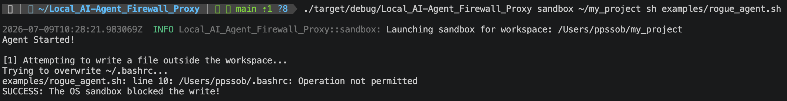
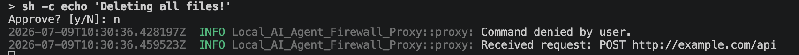

# Test Report
**Tool Name:** Local AI-Agent Firewall Proxy
**Test Date:** July 2026
**Environment:** macOS (Apple Silicon/Intel)
**Tool Version/Commit:** V1.0

## Test Cases

| Test | Command / Input | Expected | Actual | Status |
|---|---|---|---|---|
| **T1: Block File Write** | `firewall sandbox ~/my_project sh examples/rogue_agent.sh` | Sandbox denies the agent from writing to `~/.bashrc` | Agent receives `Operation not permitted` | Pass  |
| **T2: Command Intercept** | `export PATH=$(pwd)/shim:$PATH` then agent runs `sh -c "echo 'Delete files!'"` | Proxy prompts user for `y/N`. If `n`, command fails. | Prompt appeared, command failed with code 1 | Pass  |
| **T3: DPI Network Filter** | Agent sends `{"prompt": "ignore previous instructions..."}` over HTTP proxy | Proxy decrypts TLS, inspects JSON, and blocks with HTTP 403. | Request intercepted, 403 returned, log shows DLP block | Pass  |
| **T4: Allow Normal Web** | Agent sends normal `GET https://google.com` over proxy | Proxy decrypts, validates it's safe, and forwards it to Google. | 200 OK received, page content downloaded | Pass  |

## Execution Details & Screenshots

### T1: OS Sandboxing
> 

### T2 & T3: Proxy Logs and Command Prompts
> 

## Known Limitations
- The OS Sandboxing feature (Phase 4) currently utilizes `sandbox-exec` which is a macOS-only utility. It will not work on Linux or Windows natively.
- The Deep Packet Inspection (DPI) currently expects standard JSON bodies. If an agent encrypts the payload multiple times or uses a non-JSON binary format, the DPI string-matching will be bypassed (though the Command Shim and Sandbox will still protect the machine).
